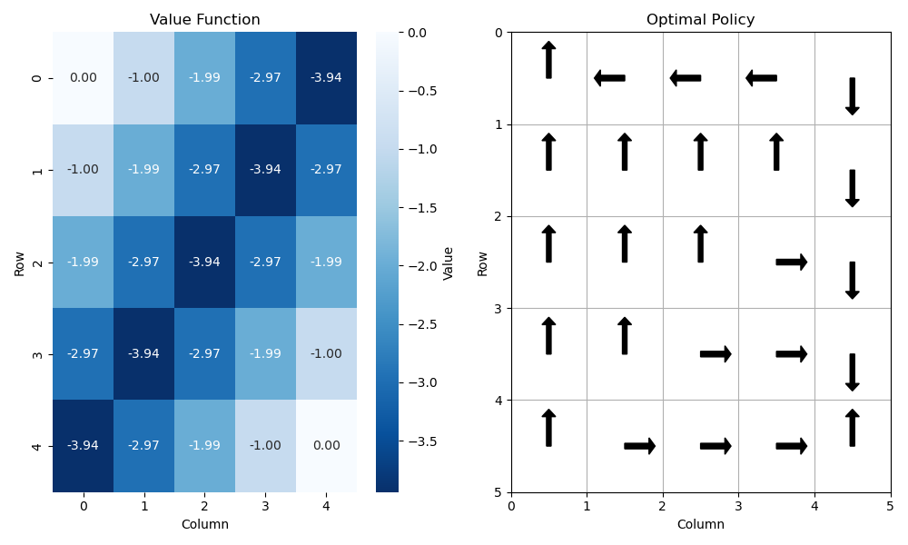

# How to Run the Notebook

1. In your terminal:

```nasm
docker compose up
```

1. In your web browser, open `localhost:8888` 
2. Enter the token `my-token` 
3. Navigate into the `work/` folder, and open the GridWorld notebook in the JupyterLab environment. 

# Introduction

[Notion Blog Link](https://harmless-resistance-e28.notion.site/Grid-World-Policy-Iteration-1324b68d0c408093beacce15f8c0d6a0?pvs=74)

The most basic Dynamic Programming application is Gridworld.





We can represent this grid as a 4x4 array, and actions are {u, d, l, r} in each state. This is an undiscounted, episodic task. The states 0 and 15 (gray above) are terminal. If an action takes the agent off the grid, the state is unchanged but we still get -1 reward. 

For the first phase of the project, I want to evaluate the equiprobable random policy, where in each state the agent has a 0.25 chance of going in any direction. 

# Policy Evaluation

Problem: given a policy $\pi$, I want to evaluate $V_\pi(s)$, the state value function, for all s.

This helps because once we have the value function, we can use it to do greedy policy improvement and policy iteration to find the optimal policy. 

How: We can iterate the Bellman Equation in place:

$$
V_{k+1}(s) = \sum_a\pi(a|s)\sum_{s', r}p(s', r| s, a)[r + \gamma V_k(s')]
$$

In fact, we can do this iteration in place while sweeping the state spaces instead of keeping a copy. Actually, we can see the difference in how many iterations it takes to converge if we don’t vs if we do it in place. 

For the gridworld, $p(s', r|s, a)$ is really straightforward. There is only one $(s', r)$ that has p = 1.

# Policy Improvement

Problem: given a state value function $V_\pi(s)$, we want to find the optimal (greedy) policy $\pi'$ on it. 

We can find the greedy action in each state by doing a one-step lookahead, again using the Bellman Equation:

$$
\pi'(s) = \argmax_a q_\pi(s, a) = \argmax_a \sum_{s',r}p(s', r|s, a)[r+\gamma V(s')]
$$

# Policy Iteration

Repeat evaluation and improvement so that you converge onto the optimal policy and value function. Let’s see how long this takes the naive way. 

# Value Iteration

Instead of using the regular Bellman Equation to iterate, we can iterate using the Bellman Optimality Equation:

$$
V_{k+1}(s) = \max_a\sum_{s', r}p(s', r| s, a)[r + \gamma V_k(s')]
$$

By doing the max during the iteration itself, we can are essentially doing one step of policy evaluation and also one step of policy improvement all in one loop. 

# Outputs

1. Final value functions after convergence. Ideally the result from naive policy iteration and value iteration should be the same. 
2. Optimal policies from each algorithm. 
3. Iterations till convergence, using $\theta=10^{-6}$. In fact a cool graph would be the change in each iteration over time for each algorithm. So we can see how quickly the convergence happens. 
    1. Once the grids got bigger than 100x100, this function took too long the converge, and it was hard to generate something like this. 
    2. At first, I was trying to keep the task purely episodic and have 0 discount factor. However, with large grids this ran into negative cycles and ended up not converging at all. Adding in a discount factor ended the negative cycles by discounting later rewards and allowed for convergence faster. 

# System Design

- Model: defines the state dynamics.
    - For each state, return all possible actions and their (s’, r).
    - Since our state space is small, this is feasible.
- Agent:
    - final value function
    - final policy
    - number of iterations (this is a little hard to define for the naive policy iteration, since each step has a number of iterations just for policy evaluation).

# Takeaways

- Value iteration really might not even come close to convergence on the value function. For a large grid of 1000x1000, the middle cells are almost all equal to -10, which is enough to make an optimal policy decision.
    - Value iteration also finishes in 4 minutes, while the full convergence can take many minutes.
- Even for episodic tasks with large episodes and potentials for negative cycles, adding the discount factor is a good idea. This will prevent negative loops!
